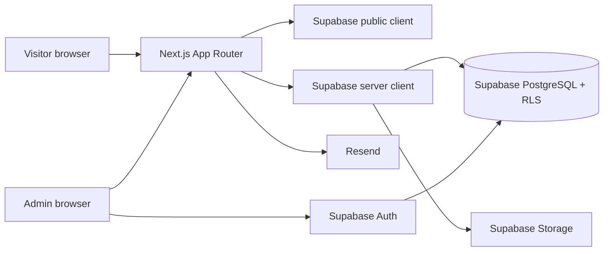

# LYNVO Architecture

## 1. System Overview

LYNVO is a Next.js App Router application deployed independently from Supabase. Next.js owns rendering, route handlers, server actions, validation, email orchestration, and cache revalidation. Supabase owns authentication, PostgreSQL, object storage, RLS, and optional realtime events.

## 2. Application Boundaries

| Boundary | Responsibility |
| --- | --- |
| `app/(public)` | Public route pages, metadata, lists, details, and conversion forms |
| `app/admin` | Authenticated CMS layout, dashboards, and content tools |
| `app/api` | Webhooks and explicit HTTP contracts where server actions are unsuitable |
| `app/actions` | Form mutations with Zod validation, auth checks, and cache revalidation |
| `components` | Domain components, shared shell, and accessible UI primitives |
| `lib/supabase` | Browser, server, and middleware Supabase clients; generated DB types |
| `supabase/migrations` | Versioned SQL schema, functions, RLS policies, seed data |

## 3. Supabase Client Rules

- Use a browser client only in client components requiring an authenticated session or user-scoped interaction.
- Use a server client based on request cookies in server components, route handlers, server actions, and middleware/proxy.
- Refresh sessions in the current Next.js request boundary using Supabase's supported SSR integration.
- Never import a service-role client into code that can reach the browser bundle.
- Prefer the normal server client so RLS remains active. Use the service-role client only for tightly controlled administrative jobs, such as a webhook or a server-only cleanup operation.

## 4. Rendering and Data Access

- Public reads run in server components and select only published/active content through public-safe views or explicit filters.
- Admin reads and writes run through server actions or protected route handlers after confirming the caller's role.
- Use stable slugs for public routing. Missing or unpublished records resolve to `notFound()`.
- Revalidate a route/tag after each successful content mutation; no client should require a hard refresh to see published work.
- Use Next.js image optimization with configured Supabase Storage remote patterns.

## 5. Authentication and Authorization

1. Staff signs in with Supabase Auth email/password.
2. A trigger creates a `profiles` record for each Auth user.
3. The admin layout obtains the user and profile server-side.
4. Missing profiles, inactive accounts, or unsupported roles are redirected to `/admin/login` or denied.
5. RLS independently restricts every query and mutation; route guards improve experience but are not the security control.

Roles are `super_admin`, `admin`, and `editor`. See [DATABASE.md](DATABASE.md) and [SECURITY.md](SECURITY.md).

## 6. Storage Design

| Bucket | Visibility | Intended objects |
| --- | --- | --- |
| `public-media` | Public read, controlled write | Project, blog, team, review, and site imagery |
| `private-uploads` | Private, signed URL only | Sensitive source files or internal attachments if introduced |

Store descriptive media fields in `media_assets`; the durable Storage object path is authoritative. Deleting an asset requires confirming it is not referenced, or intentionally replacing/removing references in the same operation.

## 7. Integrations and Operations

- Resend sends contact notifications and optional newsletter confirmations.
- Supabase migrations are applied through the Supabase CLI in CI/CD.
- Database backups, point-in-time recovery, Auth email templates, and Storage retention are configured in Supabase.
- Observability uses deployment logs, Supabase logs, and structured server-side error reporting without recording secrets or form contents unnecessarily.

## 8. Migration From Firebase

Map Firebase Auth users to Supabase Auth users, Firestore collections to normalized PostgreSQL tables, and Firebase Storage objects to the appropriate Storage bucket. Preserve IDs only where it helps links or traceability; validate each imported row before exposing it. Enable RLS before production traffic and verify public reads, admin writes, storage uploads, and rollback procedures in staging.
