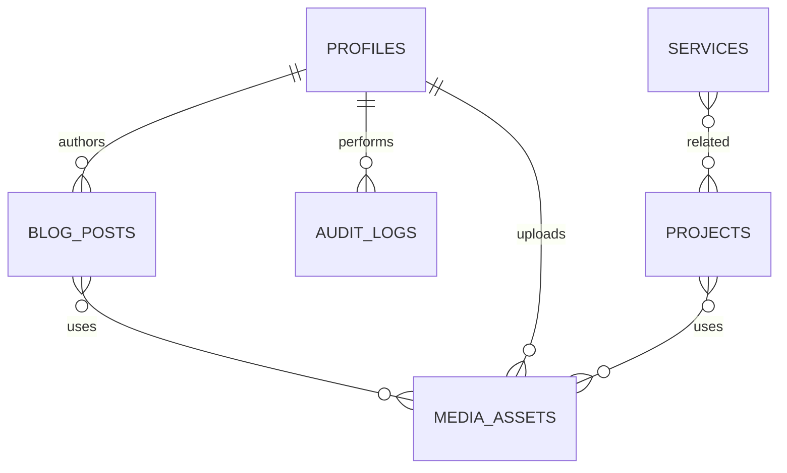

# LYNVO Database Design

## Principles

Use Supabase PostgreSQL and ordered SQL migrations in `supabase/migrations`. Use UUID primary keys, `timestamptz` audit timestamps, lowercase unique slugs, foreign keys, and junction tables where relationships need integrity. Use `jsonb` only for validated flexible content blocks. Enable RLS on every exposed table.

## Identity and Authorization

### `profiles`

| Column | Type | Notes |
| --- | --- | --- |
| `id` | `uuid` PK, FK `auth.users.id` | Auth user identity |
| `email` | `text` | Normalized address |
| `display_name` | `text` | CMS display name |
| `role` | `app_role` | `super_admin`, `admin`, or `editor` |
| `is_active` | `boolean` | Defaults true; false blocks CMS use |
| `created_at`, `updated_at` | `timestamptz` | UTC timestamps |

Create a `handle_new_user()` trigger to create a default inactive profile. Only a super admin can activate a profile or change its role. Do not trust client-controlled Auth metadata for authorization.

## Tables

| Table | Purpose | Required controls |
| --- | --- | --- |
| `site_settings` | Site-wide configuration | Singleton/key-value; no public write |
| `pages` | Managed reusable page copy | Slug, sections JSON, status, SEO |
| `services` | Service catalogue/details | Unique slug, active, featured, order, process/FAQ JSON |
| `projects` | Archive/case studies | Unique slug, status, category, industry, results |
| `blog_posts` | Editorial content | Draft/published, author FK, published time, SEO |
| `team_members` | Team profiles | Active/order, role, bio, skills, social links |
| `reviews` | Testimonials | Pending/approved/rejected, featured |
| `stats` | Public metrics | Label, value, suffix, order, active |
| `social_links` | Footer/social destinations | Platform, URL, order, active |
| `seo_settings` | Global metadata defaults | Singleton/config keys |
| `contacts` | Contact enquiries | Staff-only; `new/read/replied/archived` |
| `newsletter_subscribers` | Marketing consent records | Case-insensitive unique email |
| `media_assets` | Storage object metadata | Bucket/path, alt text, MIME, dimensions, creator |
| `audit_logs` | Privileged action history | Actor, action, entity, metadata, timestamp |

Content tables include `id`, `created_at`, `updated_at`, `created_by`, and `updated_by` as appropriate. Publicly visible rows include a publication/active state and must satisfy `published_at <= now()` when applicable.

## Relationships

Use `project_services`, `project_tags`, `blog_post_tags`, and `media_references` where needed for filtering, integrity, or protected deletion. Do not place contact-message bodies in audit logs.

## Indexes and Constraints

- Unique index on `lower(slug)` for `services`, `projects`, and `blog_posts`.
- Partial indexes for public list queries, such as `published_at desc` where `status = 'published'`.
- Unique index on `lower(email)` for newsletter subscriptions.
- Index `contacts(status, created_at desc)`, `audit_logs(created_at desc)`, and all query-heavy foreign keys.
- Check constraints for state enums, non-negative ordering, valid URLs, and plausible reading time.

## RLS Policy Matrix

| Resource | Visitor | Editor | Admin | Super admin |
| --- | --- | --- | --- | --- |
| Published public content | Read | Read | Read/write | Read/write |
| Draft content | Denied | Scoped read/write | Read/write | Read/write |
| Contacts/subscribers | Denied | Denied | Read/update | Read/update/delete by policy |
| Public media | Public read | Scoped CRUD | CRUD | CRUD |
| Profiles/roles | Own profile | Own profile | Limited staff read | Manage roles/active state |
| Audit logs | Denied | Optional own actions | Operational scope | All |

Implement predicates with small hardened `security definer` helpers such as `is_admin()` with a safe `search_path`. Test direct access as anonymous and authenticated roles.

## Storage and Migrations

Create `public-media` for public marketing assets and `private-uploads` for signed-URL-only files. Validate type, size, dimensions, and server-generated object paths. Commit all schema, policy, function, enum, index, and seed changes as migrations; generate TypeScript database types after migration changes.
